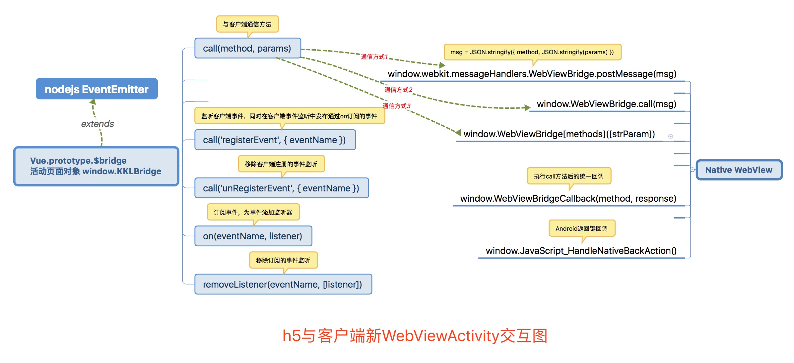

# Native WebView桥接js的使用
- **h5与客户端新WebViewActivity交互图**


- **js bridge 模块代码维护目录**  
h5 spa项目：koa-kkl-h5/src/common/utils/bridge/index.js  
h5 活动页：kkl-js-bridge/src/bridge/index.js  
cdn地址：[http://static.kaike.la/fe/libs/jsBridge.js](http://static.kaike.la/fe/libs/jsBridge.js)

- **普通方法的使用**
```javascript

// 调用客户端方法，如果需要用到客户端返回值，支持Promise语法进行处理

// es6 语法：
this.$bridge.call(methodName, params)
  .then(res => {
    // doSomething
  })

// es5语法，需要单独在页面中引用jsBridge.js cdn地址
// es5 语法：
window.KKLBridge.call(methodName, params)
  .then(function(res) {
    // doSomething
  })
```

- **事件交互的使用**
```javascript
{
  mounted() {
    // 监听客户端事件，同时在客户端事件监听中发布通过on订阅的事件
    this.$bridge.call('registerEvent', { eventName: 'viewOnPause' })

    // 多次调用并无影响，但不建议这样做
    // this.$bridge.call('registerEvent', { eventName: 'viewOnPause' })
    // this.$bridge.call('registerEvent', { eventName: 'viewOnPause' })

    // js 监听viewOnPause事件
    this.$bridge.on('viewOnPause', this.viewOnPauseListener)
  },

  // 页面离开之前应该 通知客户端移除发布过的事件，且移除h5事件监听器
  beforeRouteLeave(to, from, next) {
    // 移除客户端监听（注意是否对其他路由页面产生影响）
    // this.$bridge.call('unRegisterEvent', { eventName: 'viewOnPause' })

    // 移除js对viewOnPause事件的监听
    this.$bridge.removeListener('viewOnPause', this.viewOnPauseListener)
  }
}
```

- **Android返回键对路由的处理**
```javascript
window.JavaScript_HandleNativeBackAction = () => {
  this.$bridge.emit('androidBackKey')
}

// from NavigationBar.vue
{
  mounted() {
    this.$bridge.removeAllListeners('androidBackKey')
    this.$bridge.on('androidBackKey', () => {
      this.slide(this.to)
    })
  }
}
```

