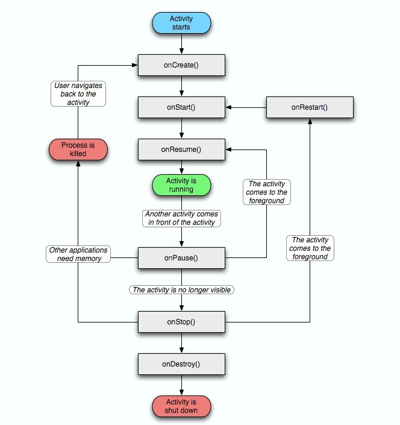
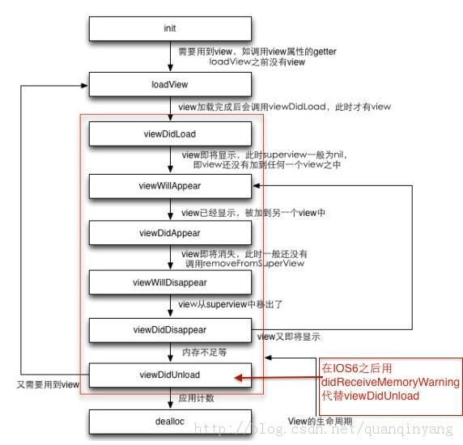

# 客户端基本知识的了解
- **初识 Android Activity 与 IOS UIViewController**

  什么是Android Activity？什么是IOS UIViewController？
手机app是由一个个Activity或UIViewController组成的，一个Activity就是你在app中看到的一个界面，相当于网站中的一个页面。

- **了解 Android Activity 的生命周期（下图摘自网络）**


- **了解 IOS UIViewController 的生命周期（下图摘自网络）**


- **在 Activity中使用 WebView**  
[了解更多](https://mp.weixin.qq.com/s/4XRB7nqTVftL5K2jAMGVVg)  
[下面代码来自博客园](https://www.cnblogs.com/whoislcj/p/5980240.html)
```java
public class MainActivity extends Activity {
    private WebView mWebView;
    private TextView logTextView;

    @Override
    public void onCreate(Bundle savedInstanceState) {
        super.onCreate(savedInstanceState);
        setContentView(R.layout.main);
        mWebView = (WebView) findViewById(R.id.webview);
        // 启用javascript
        mWebView.getSettings().setJavaScriptEnabled(true);
        // 从assets目录下面的加载html
        mWebView.loadUrl("file:///android_asset/wx.html");
        mWebView.addJavascriptInterface(this, "wx");
        logTextView = (TextView) findViewById(R.id.text);
        Button button = (Button) findViewById(R.id.button);
        button.setOnClickListener(new Button.OnClickListener() {
            public void onClick(View v) {
                // 无参数调用
                mWebView.loadUrl("javascript:actionFromNative()");
                // 传递参数调用
                mWebView.loadUrl("javascript:actionFromNativeWithParam(" + "'come from Native'" + ")");
            }
        });
    }
}
```
